# mock-server
用于前端开发的 mock 服务器

# 安装
```
// 没办法，mock-server 以经被占了，我也想不到其他好名字
npm install @rrdawlx/mock-server
```

# 使用
```
Usage: mock [options]

Options:

  -v, --version           output the version number
  --port <port>           mock 服务器要监听的端口。 (default: 9999)
  --base-dir <path>       api 请求的挂载目录，也就是 mock 数据文件的根目录，默认为当前执行命令的目录。
  --map-file <path>       api 映射文件。
  --https                 是否开启 https，默认不开启。
  --https-options <path>  https options 配置文件，格式要求是个 node 模块，返回值是一个对象。
  -h, --help              output usage information
```
# 原理


服务器接到请求后，首先会在 map-file 中寻找对应的 mock 数据文件，如果没有匹配的映射，则会在 base-dir 中根据请求路径寻找具有相同路径的 .js 或 .json 文件。例如，请求路径是 ```/a/b/c```，则会先去寻找 ```base-dir/a/b/c.js```，如果没找到就再去找```base-dir/a/b/c.json```（实际上的寻找逻辑是 [node 的模块寻找逻辑](https://nodejs.org/dist/latest-v10.x/docs/api/modules.html#modules_all_together)，但为了简单和统一规范，我们在此就错误地理解为只去 base-dir 中寻找具有相同路径的 .js 或 .json 文件）。如果最终没有找到相应的 mock 数据文件，则会响应 404。  
map-file 和 mock 数据文件修改后无需重启服务器就可响应最新数据。

# api 映射文件 map-file
直接看例子：
```
const path = require('path')

module.exports = [
  // ['/request/path', '/mock/file/path']
  ['/map/api', path.join(__dirname, './mock-files/object.js')],
  ['/restful/:param', path.join(__dirname, './mock-files/restful.js')],
]
```
map-file 的形式是一个 node 模块，返回值是一个数组，其中的每一项又是数组，代表一个 api 的映射。每个映射数组的第一项是 api 的请求路径，支持 restful 风格的路径；第二项是 mock 数据文件的**绝对路径**。

# mock 数据
mock 数据的例子可以查看项目仓库中的 examples/mock-files 文件夹。
mock 数据文件可以是一个 .json 形式的 node 模块，例如 examples/mock-files/json.json ：
```
{
  "msg": "this is a json module."
}
```
也可以是一个 .js 形式的 node 模块。其返回值可以是一个对象，例如 examples/mock-files/object.js ：
```
module.exports = {
  msg: 'this is object module'
}
```
也可以是一个函数，例如 examples/mock-files/function.js ：
```
module.exports = function (req) {
  return {
    msg: `you request ${req.path}, this is a function module!`
  }
}
```
函数有一个参数 req，是 express 的请求对象，具体信息可以查看 express 的 [request 对象文档](http://www.expressjs.com.cn/4x/api.html#req)。当在 map-file 中配置了 restful 风格的路径，可以在 req.params 对象中读取相关的路径参数，例如 examples/mock-files/restful.js :
```
// map-file 中的配置：
// ['/restful/:param', path.join(__dirname, './mock-files/restful.js')]

module.exports = function(req) => {
  return {msg: `this is a restful api, param = ${req.params.param}`}
}
```
函数的返回值可以是一个简单对象，就像上面的例子，也可以是一个 promise 对象，例如 examples/mock-files/promise.js ：
```
module.exports = function() {
  return new Promise(resolve => {
    setTimeout(() => {
      resolve({
        msg: 'this is a promise module'
      })
    }, 1000);
  })
}
```
在上面的例子中，服务器将会在 1 秒钟后响应请求。  
如果返回的 promise 对象最终变成了 rejected 状态，则会返回 4XX、5XX 状态码的错误，如 examples/mock-files/error/reject.js ：
```
module.exports = function() {
  return new Promise((resolve, reject) => {
    reject()
    // reject(501)
    // reject({code: 502})
  })
}
```
具体的返回结果和状态码，可以试一下 examples/mock-files 中的例子。
